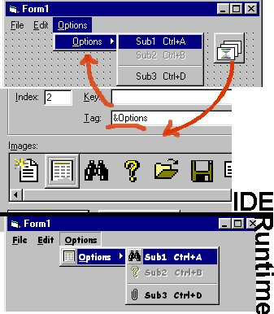



## CoolMenu \(real icon menus\)

### Description

Display real Office like icon menus.

Source code based on Paul DiLascia's work from the Microsoft System Journal (Jan98); ported from VC++ to VB by me + some adaptation. visit www.dilascia.com 

**Features: 

Real Office like icon menus; 

Partial Win98 main menu effect in Win95 (need help for full effect if possible); 

Embossed pictures in color (thanks Paul); 

Uses the form's font (~and style attributes); 

Working "local" and "global" accelerators (&, Ctrl+?); 

Easy interfacing between ImageList and VB's Menu Editor;

Take a look at the screen shot !
 
### More Info
 
I hope the code is documented enough

             |
---                |---
**Submitted On**   |2000-05-15 14:53:40
**By**             |[Olivier Martin](https://github.com/Planet-Source-Code/PSCIndex/blob/master/ByAuthor/olivier-martin.md)
**Level**          |Advanced
**User Rating**    |4.9 (162 globes from 33 users)
**Compatibility**  |VB 5\.0, VB 6\.0
**Category**       |[Custom Controls/ Forms/  Menus](https://github.com/Planet-Source-Code/PSCIndex/blob/master/ByCategory/custom-controls-forms-menus__1-4.md)
**World**          |[Visual Basic](https://github.com/Planet-Source-Code/PSCIndex/blob/master/ByWorld/visual-basic.md)
**Archive File**   |[CODE\_UPLOAD58155152000\.zip](https://github.com/Planet-Source-Code/olivier-martin-coolmenu-real-icon-menus__1-7967/archive/master.zip)

